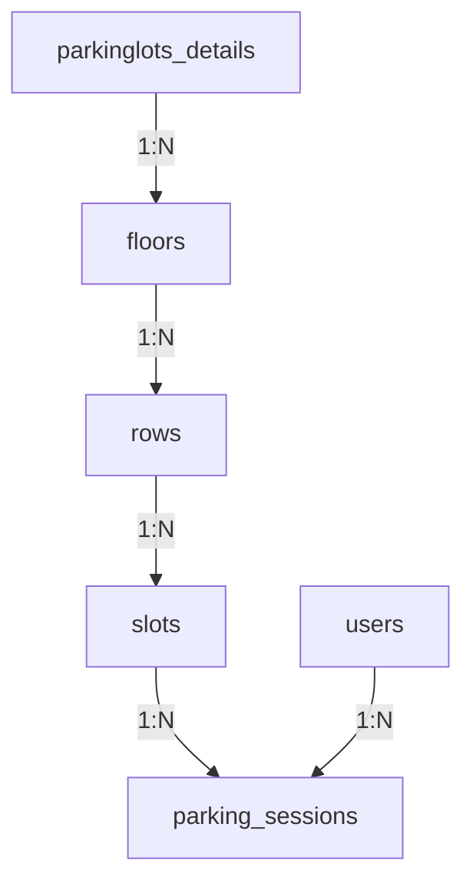
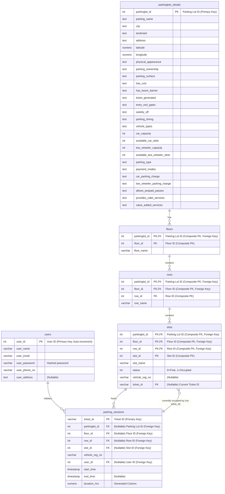

# 🚗 Car_Parking_Database – PostgreSQL Schema 🛢️ [](https://github.com)  [](https://www.postgresql.org/)

* **Database Structure** 📊:

  * Tables for parking lots, floors, rows, slots, users, and parking sessions.
* **Data Integrity** 🔒:

  * Primary and foreign keys enforce referential integrity.
  * Check constraints on slot occupancy status.
  * Unique constraints on user email and phone numbers.
* **Sample Data** 📝:

  * Includes initial data for parking lot details and floor configurations.
* **Entity-Relationship Diagrams (ERDs)** 📈:

  * Provided in both Mermaid syntax and PNG formats.
  * Detailed ERD descriptions explain the database design.

 
## Table of Contents
- [🚗 Car\_Parking\_Database – PostgreSQL Schema 🛢️](#-car_parking_database--postgresql-schema-)
  - [Table of Contents](#table-of-contents)
  - [🐘 PostgreSQL Installation Guide](#-postgresql-installation-guide)
    - [🪟 Windows](#-windows)
    - [🍎 macOS](#-macos)
    - [🐧 Ubuntu / Debian Linux](#-ubuntu--debian-linux)
  - [Database Setup 💾](#database-setup-)
    - [1. Create a New Database](#1-create-a-new-database)
    - [2. Import the Schema via Command Line](#2-import-the-schema-via-command-line)
    - [3. Import the Schema via pgAdmin 4](#3-import-the-schema-via-pgadmin-4)
    - [4. Verify the Import](#4-verify-the-import)
  - [Database Design 🏗️](#database-design-)
    - [High-Level Design](#high-level-design)
    - [Low-Level Design](#low-level-design)
    - [Table-Relationships](#table-relationships)
  - [📦 Schema Details](#-schema-details)
    - [🅿️ `parkinglots_details`](#️-parkinglots_details)
    - [🏢 `floors`](#-floors)
    - [🪑 `rows`](#-rows)
    - [🚗 `slots`](#-slots)
    - [👤 `users`](#-users)
    - [🎫 `parking_sessions`](#-parking_sessions)
  - [🧩 Composite Key Summary](#-composite-key-summary)
  - [Additional Notes 📝](#additional-notes-)
    - [References 📚](#references-)


## 🐘 PostgreSQL Installation Guide

[](https://www.postgresql.org/)

PostgreSQL is a robust, open-source relational database available on Windows, macOS, and Linux. This guide walks you through installing PostgreSQL on each platform and then shows you how to import your `parking_database_backup.sql` (which only works via the `psql` client).

### 🪟 Windows

1. **Download the EDB Installer**
   Visit the official PostgreSQL Windows download page and grab the Interactive Installer maintained by EnterpriseDB.
2. **Run the Installer**
   Execute the downloaded `.exe`, accept defaults (or customize install path/version), and ensure "pgAdmin" and "Command Line Tools" are selected.
3. **Verify Installation**
   Open **SQL Shell (psql)**, press Enter for host/port/database/user/password defaults. Seeing the `postgres=#` prompt confirms success.


### 🍎 macOS

1. **Install Homebrew** (if not already present):

   ```bash
   /bin/bash -c "$(curl -fsSL https://raw.githubusercontent.com/Homebrew/install/HEAD/install.sh)"
   ```

2. **Install PostgreSQL**:

   ```bash
   brew update
   brew install postgresql@17
   ```

3. **Start the Service**:

   ```bash
   brew services start postgresql@17
   ```

4. **Verify Installation**:

   ```bash
   psql --version
   psql postgres
   ```


### 🐧 Ubuntu / Debian Linux

1. **Add PostgreSQL Apt Repository** (for PostgreSQL 17):

   ```bash
   sudo sh -c 'echo "deb https://apt.postgresql.org/pub/repos/apt $(lsb_release -cs)-pgdg main" > /etc/apt/sources.list.d/pgdg.list'
   wget --quiet -O - https://www.postgresql.org/media/keys/ACCC4CF8.asc | sudo apt-key add -
   ```

2. **Install PostgreSQL**:

   ```bash
   sudo apt update
   sudo apt install -y postgresql-17 postgresql-contrib-17
   ```

3. **Enable and Start Service**:

   ```bash
   sudo systemctl enable postgresql
   sudo systemctl start postgresql
   ```

4. **Verify Installation**:

   ```bash
   sudo -i -u postgres psql -c "\l"
   ```
   
## Database Setup 💾

[](https://www.postgresql.org/)

This section outlines how to create a new PostgreSQL database and import the provided SQL dump (`parking_database_backup.sql`) using both the `psql` command‐line client and the pgAdmin 4 GUI. 

### 1. Create a New Database

Use the PostgreSQL superuser (`postgres`) to create an empty database (e.g., `parking_db`):

```bash
# Connect as postgres user
sudo -u postgres psql

# Inside psql, create database
CREATE DATABASE parking_db;

# Exit psql
\q

# Alternative one-liner
sudo -u postgres createdb parking_db
```

This creates a new database named `parking_db` and makes the executing user the owner of the new database.

### 2. Import the Schema via Command Line

Once the database exists, import the SQL dump using `psql` in one of two ways:

* **Using the `-f` flag**

  ```bash
  psql -U postgres -d parking_db -f parking_database_backup.sql
  ```

  This tells `psql` to connect as user `postgres` to database `parking_db` and execute all commands in the file.

* **Using input redirection**

  ```bash
  psql --username=postgres parking_db < parking_database_backup.sql
  ```

  Redirecting the file into `psql` achieves the same effect: it reads and runs each statement sequentially.

> **Note:** The target database must already exist before running either command.


### 3. Import the Schema via pgAdmin 4

1. **Connect & Select Database**

   * Open pgAdmin 4 and connect to your PostgreSQL server.
   * In the **Browser** pane, right-click the **Databases** node and choose **Create → Database…** if `parking_db` doesn't exist yet.
   * Fill in the database name as `parking_db` and click Save.

2. **Open the Query Tool**

   * Right-click on `parking_db` and select **Query Tool** from the context menu.

3. **Load & Execute**

   * In the Query Tool toolbar, click the **Open File** (📂) icon and browse to `parking_database_backup.sql`.
   * Click the **Execute/Refresh** (⚡) button to run the script and populate your database.

### 4. Verify the Import

* **In `psql`**:

  ```sql
  # Connect to the database
  psql -U postgres -d parking_db
  
  # List all tables
  \dt
  
  # Count rows in a specific table
  SELECT COUNT(*) FROM parkinglots_details;
  
  # Exit psql
  \q
  ```

  Lists all tables in the current database.

* **In pgAdmin**:
  
  Refresh the **Schemas → public → Tables** node to see the newly created tables and sample data.


## Database Design 🏗️

[](https://github.com)

### High-Level Design

The parking management database is structured around a clear hierarchy of entities and their relationships:

* **Parking Lots** (`parkinglots_details`): Each record represents a unique parking facility.
* **Floors** (`floors`): One or more floors per parking lot.
* **Rows** (`rows`): Multiple rows within each floor.
* **Slots** (`slots`): Individual parking spaces within each row.
* **Users** (`users`): Registered customers of the parking system.
* **Parking Sessions** (`parking_sessions`): History of each car's stay, linking a user to a specific slot over time.

*Figure: Entity-Relationship Diagram of the parking management database (Mermaid diagram).*

* A given **slot** can host many past sessions (1\:N), but at most one active session at any time (enforced via application logic/check constraint).
* A **user** may initiate many parking sessions (1\:N).

You can also view the ERD [PNG file](ERD_parking_app.pgerd.png).

### Low-Level Design

At the table level, the schema uses composite keys and foreign keys to enforce the above relationships. Key design points include:

* **parkinglots\_details:** Has primary key `parkinglot_id` (unique ID for each parking lot).
* **floors:** Uses composite primary key (`parkinglot_id, floor_id`). The column `parkinglot_id` is a foreign key referencing `parkinglots_details(parkinglot_id)`. This allows multiple floors per parking lot.
* **rows:** Uses composite primary key (`parkinglot_id, floor_id, row_id`). The `(parkinglot_id, floor_id)` pair is a foreign key referencing `floors`, so each row belongs to a specific floor of a specific lot.
* **slots:** Uses composite primary key (`parkinglot_id, floor_id, row_id, slot_id`). The `(parkinglot_id, floor_id, row_id)` triple is a foreign key referencing `rows`, linking each slot to its row.
* **users:** Has primary key `user_id` (auto-incrementing). Unique constraints are placed on `user_email` and `user_phone_no` to prevent duplicates.
* **parking\_sessions:** Uses primary key `ticket_id`. It has foreign keys on `(parkinglot_id, floor_id, row_id, slot_id)` referencing `slots` (indicating which slot is used), and on `user_id` referencing `users`.

These constraints ensure data integrity. For example, a session cannot reference a slot that doesn't exist, and a floor cannot exist without its parent parking lot.



### Table-Relationships

| Parent Table         | Child Table         | Relationship Type | Foreign Key(s)                                       |
|----------------------|---------------------|-------------------|------------------------------------------------------|
| parkinglots_details  | floors              | 1:N               | floors.parkinglot_id → parkinglots_details          |
| floors               | rows                | 1:N               | rows.parkinglot_id, floor_id → floors               |
| rows                 | slots               | 1:N               | slots.parkinglot_id, floor_id, row_id → rows        |
| slots                | parking_sessions    | 1:N               | parking_sessions.(...) → slots                      |
| users                | parking_sessions    | 1:N               | parking_sessions.user_id → users                    |

## 📦 Schema Details

[](https://www.postgresql.org/)

### 🅿️ `parkinglots_details`

| Column                        | Data Type | Constraints      |
| ----------------------------- | --------- | ---------------- |
| `parkinglot_id`               | integer   | **PK**, Not Null |
| `parking_name`                | text      |                  |
| `city`                        | text      |                  |
| `landmark`                    | text      |                  |
| `address`                     | text      |                  |
| `latitude`                    | numeric   |                  |
| `longitude`                   | numeric   |                  |
| `physical_appearance`         | text      |                  |
| `parking_ownership`           | text      |                  |
| `parking_surface`             | text      |                  |
| `has_cctv`                    | text      |                  |
| `has_boom_barrier`            | text      |                  |
| `ticket_generated`            | text      |                  |
| `entry_exit_gates`            | text      |                  |
| `weekly_off`                  | text      |                  |
| `parking_timing`              | text      |                  |
| `vehicle_types`               | text      |                  |
| `car_capacity`                | integer   |                  |
| `available_car_slots`         | integer   |                  |
| `two_wheeler_capacity`        | integer   |                  |
| `available_two_wheeler_slots` | integer   |                  |
| `parking_type`                | text      |                  |
| `payment_modes`               | text      |                  |
| `car_parking_charge`          | text      |                  |
| `two_wheeler_parking_charge`  | text      |                  |
| `allows_prepaid_passes`       | text      |                  |
| `provides_valet_services`     | text      |                  |
| `value_added_services`        | text      |                  |

**Primary Key:** (`parkinglot_id`)

|No. of rows|No. of Cols.|
|-----------|------------|
|87         |28          |

**Example data:**

| parkinglot\_id | parking\_name      | city      | landmark    | address | latitude | longitude | physical\_appearance | parking\_ownership | parking\_surface | has\_cctv | has\_boom\_barrier | ticket\_generated | entry\_exit\_gates | weekly\_off | parking\_timing | vehicle\_types | car\_capacity | available\_car\_slots | two\_wheeler\_capacity | available\_two\_wheeler\_slots | parking\_type | payment\_modes | car\_parking\_charge | two\_wheeler\_parking\_charge | allows\_prepaid\_passes | provides\_valet\_services | value\_added\_services |
| -------------- | ------------------ | --------- | ----------- | ------- | -------- | --------- | -------------------- | ------------------ | ---------------- | --------- | ------------------ | ----------------- | ------------------ | ----------- | --------------- | -------------- | ------------- | --------------------- | ---------------------- | ------------------------------ | ------------- | -------------- | -------------------- | ----------------------------- | ----------------------- | ------------------------- | ---------------------- |
| 2              | Azadpur Complex    | New Delhi | CinemaLand  | Main St | 28.7097  | 77.1779   | Open-Covered         | Government         | Mud              | No        | No                 | No ticket         | MultiGate          | AllDays     | 00:00-24:00     | Car,2W         | 200           | 200                   | 250                    | 250                            | Free          | Cash           | 20/hr                | 10/hr                         | No                      | No                        | None                   |
| 3              | ISBT Kashmere Gate | New Delhi | Bus Station | 1st Ave | 28.6686  | 77.2295   | Open-Covered         | Government         | Cemented         | Yes       | No                 | No ticket         | MultiGate          | AllDays     | 07:00-23:00     | Car,2W         | 300           | 300                   | 400                    | 400                            | Free          | Cash           | 20/hr                | 10/hr                         | No                      | No                        | Guards                 |


### 🏢 `floors`

| Column          | Data Type   | Constraints                                           |
| --------------- | ----------- | ----------------------------------------------------- |
| `parkinglot_id` | integer     | **PK**, **FK → parkinglots\_details(parkinglot\_id)** |
| `floor_id`      | integer     | **PK**                                                |
| `floor_name`    | varchar(50) | Not Null                                              |

**Primary Key:** (`parkinglot_id`, `floor_id`)
**Foreign Key:** (`parkinglot_id`) → `parkinglots_details(parkinglot_id)`
|No. of rows|No. of Cols.|
|-----------|------------|
|10         |3           |

**Example data:**

| parkinglot\_id | floor\_id | floor\_name    |
| -------------- | --------- | -------------- |
| 1              | 1         | Ground Floor   |
| 1              | 2         | Basement Level |


### 🪑 `rows`

| Column          | Data Type   | Constraints                             |
| --------------- | ----------- | --------------------------------------- |
| `parkinglot_id` | integer     | **PK**, **FK → floors(parkinglot\_id)** |
| `floor_id`      | integer     | **PK**, **FK → floors(floor\_id)**      |
| `row_id`        | integer     | **PK**                                  |
| `row_name`      | varchar(50) | Not Null                                |

**Primary Key:** (`parkinglot_id`, `floor_id`, `row_id`)
**Foreign Key:** (`parkinglot_id`, `floor_id`) → `floors(parkinglot_id, floor_id)`
|No. of rows|No. of Cols.|
|-----------|------------|
|20         |4           |

**Example data:**

| parkinglot\_id | floor\_id | row\_id | row\_name |
| -------------- | --------- | ------- | --------- |
| 1              | 1         | 1       | Row A     |
| 1              | 1         | 2       | Row B     |


### 🚗 `slots`

| Column           | Data Type   | Constraints                                  |
| ---------------- | ----------- | -------------------------------------------- |
| `parkinglot_id`  | integer     | **PK**, **FK → rows(parkinglot\_id)**        |
| `floor_id`       | integer     | **PK**, **FK → rows(floor\_id)**             |
| `row_id`         | integer     | **PK**, **FK → rows(row\_id)**               |
| `slot_id`        | integer     | **PK**                                       |
| `slot_name`      | varchar(50) | Not Null                                     |
| `status`         | integer     | Default 0 (Check: 0 = Free, 1 = Occupied)    |
| `vehicle_reg_no` | varchar(20) | Nullable (Must be NOT NULL if status = 1)    |
| `ticket_id`      | varchar(50) | Nullable (FK → `parking_sessions.ticket_id`) |


**Primary Key:** (`parkinglot_id`, `floor_id`, `row_id`, `slot_id`)
**Foreign Key:** (`parkinglot_id`, `floor_id`, `row_id`) → `rows(parkinglot_id, floor_id, row_id)`
**Foreign Key:** (`ticket_id`) → `parking_sessions(ticket_id)` *(nullable)*
|No. of rows|No. of Cols.|
|-----------|------------|
|400        |8           |

**Example data:**

| parkinglot\_id | floor\_id | row\_id | slot\_id | slot\_name | status | vehicle\_reg\_no | ticket\_id |
| -------------- | --------- | ------- | -------- | ---------- | ------ | ---------------- | ---------- |
| 1              | 1         | 1       | 1        | A1         | 0      |                  |            |
| 1              | 1         | 1       | 2        | A2         | 1      | ABC123           | T001       |

**Check Constraint:**
If `status = 1` → `vehicle_reg_no` and `ticket_id` must be NOT NULL.
If `status = 0` → `vehicle_reg_no` and `ticket_id` must be NULL.


### 👤 `users`

| Column          | Data Type    | Constraints            |
| --------------- | ------------ | ---------------------- |
| `user_id`       | integer      | **PK**, auto-increment |
| `user_name`     | varchar(100) | Not Null               |
| `user_email`    | varchar(100) | Not Null, **Unique**   |
| `user_password` | varchar(100) | Not Null               |
| `user_phone_no` | varchar(15)  | Not Null, **Unique**   |
| `user_address`  | text         | Nullable               |

**Primary Key:** (`user_id`)
|No. of rows|No. of Cols.|
|-----------|------------|
|10         |6           |

**Example data:**

| user\_id | user\_name | user\_email                                   | user\_password | user\_phone\_no | user\_address |
| -------- | ---------- | --------------------------------------------- | -------------- | --------------- | ------------- |
| 1        | Alice      | [alice@example.com](mailto:alice@example.com) | password123    | 1234567890      | 123 Main St   |
| 2        | Bob        | [bob@example.com](mailto:bob@example.com)     | securepwd      | 0987654321      | 456 Oak Ave   |


### 🎫 `parking_sessions`

| Column           | Data Type                   | Constraints                                        |
| ---------------- | --------------------------- | -------------------------------------------------- |
| `ticket_id`      | varchar(50)                 | **PK**                                             |
| `parkinglot_id`  | integer                     | **FK → slots(parkinglot\_id)**                     |
| `floor_id`       | integer                     | **FK → slots(floor\_id)**                          |
| `row_id`         | integer                     | **FK → slots(row\_id)**                            |
| `slot_id`        | integer                     | **FK → slots(slot\_id)**                           |
| `vehicle_reg_no` | varchar(20)                 | Not Null                                           |
| `user_id`        | integer                     | **FK → users(user\_id)**                           |
| `start_time`     | timestamp without time zone |                                                    |
| `end_time`       | timestamp without time zone |                                                    |
| `duration_hrs`   | numeric (GENERATED STORED)  | Computed: `ROUND((end_time - start_time)/3600, 1)` |

**Primary Key:** (`ticket_id`)
**Foreign Key:** (`parkinglot_id`, `floor_id`, `row_id`, `slot_id`) → `slots(parkinglot_id, floor_id, row_id, slot_id)`
**Foreign Key:** (`user_id`) → `users(user_id)`
|No. of rows|No. of Cols.|
|-----------|------------|
|0          |0          |

**Example data:**

| ticket\_id | parkinglot\_id | floor\_id | row\_id | slot\_id | vehicle\_reg\_no | user\_id | start\_time         | end\_time           | duration\_hrs |
| ---------- | -------------- | --------- | ------- | -------- | ---------------- | -------- | ------------------- | ------------------- | ------------- |
| T001       | 1              | 1         | 1       | 2        | ABC123           | 1        | 2025-05-01 08:00:00 | 2025-05-01 10:00:00 | 2.0           |
| T002       | 1              | 1         | 2       | 1        | XYZ789           | 2        | 2025-05-02 14:15:00 | 2025-05-02 16:45:00 | 2.5           |


## 🧩 Composite Key Summary

| Table              | Composite Primary Key                              | Foreign Keys                                                                      |
| ------------------ | -------------------------------------------------- | --------------------------------------------------------------------------------- |
| `floors`           | (`parkinglot_id`, `floor_id`)                      | `parkinglot_id` → `parkinglots_details`                                           |
| `rows`             | (`parkinglot_id`, `floor_id`, `row_id`)            | (`parkinglot_id`, `floor_id`) → `floors`                                          |
| `slots`            | (`parkinglot_id`, `floor_id`, `row_id`, `slot_id`) | (`parkinglot_id`, `floor_id`, `row_id`) → `rows`                                  |
| `parking_sessions` | `ticket_id`                                        | (`parkinglot_id`, `floor_id`, `row_id`, `slot_id`) → `slots`; `user_id` → `users` |

## Additional Notes 📝

[](https://github.com)

* **Constraints & Integrity** 🔐: The database uses composite primary keys (`parkinglot_id` + `floor_id`, etc.) to uniquely identify sub-entities. Foreign key constraints enforce that, for example, a **floor** cannot exist without its parent **parking lot**, and a **slot** cannot exist without its parent **row**. Unique constraints on user email and phone ensure no duplicates.
* **Performance** ⚡: For large datasets, consider adding indexes on foreign key columns (e.g., `parkinglot_id`, `user_id`) to speed up joins. PostgreSQL automatically indexes primary keys.
* **Data Import** 📥: Always wrap bulk import scripts in a transaction or use `BEGIN/COMMIT` to ensure atomicity. The provided dump can be loaded in one step as shown above.
* **Maintenance** 🧰: After major data changes, run `VACUUM ANALYZE` to update query planner statistics. Regularly back up your database (using `pg_dump` or continuous backups).
* **Extensibility** 🔄: The schema is normalized to 3NF. You can extend it by adding new tables (e.g. `payments`, `pass_holders`) with appropriate foreign keys. The ERD (Fig.

### References 📚
- [PostgreSQL 17 Documentation](https://www.postgresql.org/docs/17/)
- [PostgreSQL Index Types](https://www.postgresql.org/docs/17/indexes-types.html)
- [Data Modeling Best Practices](https://www.postgresql.org/docs/17/ddl-schemas.html)
