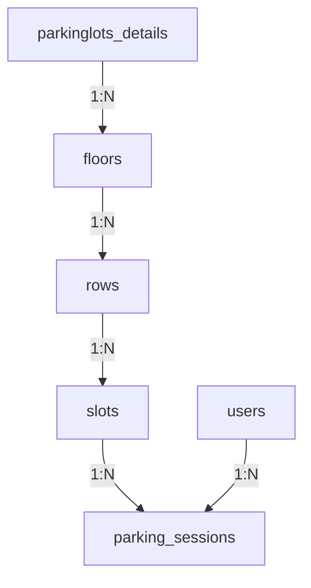
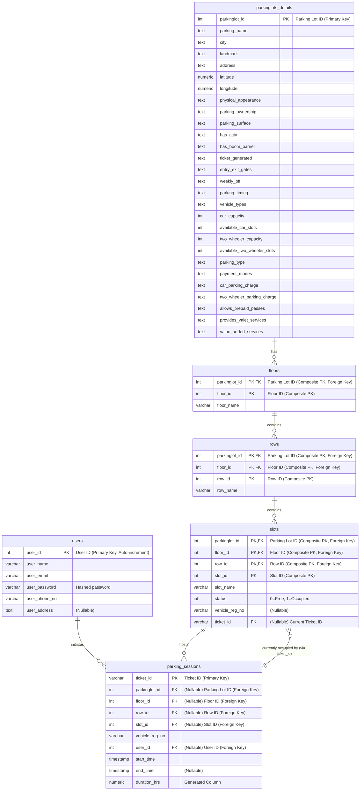

# Parking Management System Database

This project provides a PostgreSQL database schema for a parking management system. It includes tables for parking lot details, floors, rows of slots, individual slots, users, and parking sessions. The schema enforces primary and foreign keys to maintain referential integrity, check constraints on slot occupancy status, and unique constraints on user email/phone. Sample data populates parking lot details and floors. The repository also contains ER diagrams (Mermaid and PNG) and a detailed ERD description to explain the design.

## Table of Contents

* [Installation](#installation)
* [Database Setup](#database-setup)
* [Database Design](#database-design)

  * [High-Level Design](#high-level-design)
  * [Low-Level Design](#low-level-design)
* [Schema Details](#schema-details)

  * [parkinglots\_details](#parkinglots_details)
  * [floors](#floors)
  * [rows](#rows)
  * [slots](#slots)
  * [users](#users)
  * [parking\_sessions](#parking_sessions)
* [Additional Notes](#additional-notes)
Certainly! Here's an improved version of your PostgreSQL installation guide in Markdown format, tailored for **Windows**, **macOS**, and **Linux** users:

---

## 🐘 PostgreSQL Installation Guide

PostgreSQL is a powerful, open-source relational database system available for all major operating systems. Below are the recommended installation methods for each platform.

---

### 🪟 Windows

**Download the Installer**
   Visit the official [PostgreSQL Windows download page](https://www.postgresql.org/download/windows/) and download the installer provided by EnterpriseDB.


> 🔍 **Verify Installation**
> Open the **SQL Shell (psql)** and press Enter four times to accept the default settings. If you see the `postgres=#` prompt, the installation was successful.

---

### 🍎 macOS

#### Install via Homebrew (Recommended)

1. **Install Homebrew**
   If you haven't installed Homebrew, open Terminal and run:

   ```bash
   /bin/bash -c "$(curl -fsSL https://raw.githubusercontent.com/Homebrew/install/HEAD/install.sh)"
   ```

2. **Install PostgreSQL**
   Once Homebrew is installed, run:

   ```bash
   brew update
   brew install postgresql
   ```

3. **Start PostgreSQL Service**
   To start PostgreSQL and set it to run at login:

   ```bash
   brew services start postgresql
   ```

> 🔍 **Verify Installation**
> Check the PostgreSQL version:
>
> ```bash
> psql --version
> ```
>
> Access the PostgreSQL shell:
>
> ```bash
> psql postgres
> ```


### 🐧 Linux

#### Ubuntu/Debian

1. **Update Package Lists**

   ```bash
   sudo apt update
   ```

2. **Install PostgreSQL**

   ```bash
   sudo apt install postgresql postgresql-contrib
   ```

3. **Start PostgreSQL Service**

   ```bash
   sudo systemctl start postgresql
   sudo systemctl enable postgresql
   ```

> 🔍 **Verify Installation**
> Access the PostgreSQL shell:
>
> ```bash
> sudo -i -u postgres psql
> ```

## Database Setup

1. **Create a Database:** Using the `postgres` superuser, create a new database (e.g., `parking_db`):

   ```bash
   sudo -u postgres createdb parking_db
   ```
2. **Import the Schema:** You can import the provided SQL dump (`parking_database_backup.sql`) using either the command line or pgAdmin:

   * **Command Line (psql):**
     Ensure the target database exists, then run:

     ```bash
     psql -U postgres -d parking_db -f parking_database_backup.sql
     ```

     This executes the SQL script and sets up all tables and sample data. Alternatively, you can use input redirection:

     ```bash
     psql --username=postgres parking_db < parking_database_backup.sql
     ```

     (Note: the database must be created beforehand).

   * **pgAdmin 4:**

     1. Open pgAdmin and connect to your server.
     2. Create or select the target database (e.g., `parking_db`).
     3. Click **Tools > Query Tool**.
     4. In the Query Tool, click the open-file icon (📂), browse to `parking_database_backup.sql`, and open it.
     5. Execute the script by clicking the lightning-bolt icon (➤). This will run all SQL commands from the file and populate the database.

After import, you can run `\dt` in psql or refresh pgAdmin to see the created tables and data.

## Database Design


### High-Level Design

&#x20;*Figure: Entity-Relationship Diagram of the parking management database (embedded image).* The ERD shows the main entities and relationships. A `parkinglots_details` record *has* one or more `floors`, each `floor` contains many `rows`, and each `row` contains many `slots`. Registered `users` can initiate multiple `parking_sessions` (one-to-many). Each `slot` can host many historical sessions over time (one-to-many), but at any given moment a slot is associated with at most one active session (optional one-to-one).

*Figure: Entity-Relationship Diagram of the parking management database (Mermaid diagram).*



You can also view the ERD [PNG file](ERD_parking_app.pgerd.png).

### Low-Level Design

At the table level, the schema uses composite keys and foreign keys to enforce the above relationships. Key design points include:

* **parkinglots\_details:** Has primary key `parkinglot_id` (unique ID for each parking lot).
* **floors:** Uses composite primary key (`parkinglot_id, floor_id`). The column `parkinglot_id` is a foreign key referencing `parkinglots_details(parkinglot_id)`. This allows multiple floors per parking lot.
* **rows:** Uses composite primary key (`parkinglot_id, floor_id, row_id`). The `(parkinglot_id, floor_id)` pair is a foreign key referencing `floors`, so each row belongs to a specific floor of a specific lot.
* **slots:** Uses composite primary key (`parkinglot_id, floor_id, row_id, slot_id`). The `(parkinglot_id, floor_id, row_id)` triple is a foreign key referencing `rows`, linking each slot to its row.
* **users:** Has primary key `user_id` (auto-incrementing). Unique constraints are placed on `user_email` and `user_phone_no` to prevent duplicates.
* **parking\_sessions:** Uses primary key `ticket_id`. It has foreign keys on `(parkinglot_id, floor_id, row_id, slot_id)` referencing `slots` (indicating which slot is used), and on `user_id` referencing `users`.

These constraints ensure data integrity. For example, a session cannot reference a slot that doesn’t exist, and a floor cannot exist without its parent parking lot.



# Detailed Table Relationships in Parking Management System

# Summary Table

| Parent Table         | Child Table         | Relationship Type | Foreign Key(s)                                       |
|----------------------|---------------------|-------------------|------------------------------------------------------|
| parkinglots_details  | floors              | 1:N               | floors.parkinglot_id → parkinglots_details          |
| floors               | rows                | 1:N               | rows.parkinglot_id, floor_id → floors               |
| rows                 | slots               | 1:N               | slots.parkinglot_id, floor_id, row_id → rows        |
| slots                | parking_sessions    | 1:N               | parking_sessions.(...) → slots                      |
| users                | parking_sessions    | 1:N               | parking_sessions.user_id → users                    |

## Schema Details

#### parkinglots\_details

| Column                         | Data Type | Constraints  |
| ------------------------------ | --------- | ------------ |
| parkinglot\_id                 | integer   | Not Null, PK |
| parking\_name                  | text      |              |
| city                           | text      |              |
| landmark                       | text      |              |
| address                        | text      |              |
| latitude                       | numeric   |              |
| longitude                      | numeric   |              |
| physical\_appearance           | text      |              |
| parking\_ownership             | text      |              |
| parking\_surface               | text      |              |
| has\_cctv                      | text      |              |
| has\_boom\_barrier             | text      |              |
| ticket\_generated              | text      |              |
| entry\_exit\_gates             | text      |              |
| weekly\_off                    | text      |              |
| parking\_timing                | text      |              |
| vehicle\_types                 | text      |              |
| car\_capacity                  | integer   |              |
| available\_car\_slots          | integer   |              |
| two\_wheeler\_capacity         | integer   |              |
| available\_two\_wheeler\_slots | integer   |              |
| parking\_type                  | text      |              |
| payment\_modes                 | text      |              |
| car\_parking\_charge           | text      |              |
| two\_wheeler\_parking\_charge  | text      |              |
| allows\_prepaid\_passes        | text      |              |
| provides\_valet\_services      | text      |              |
| value\_added\_services         | text      |              |

**Example data:**

| parkinglot\_id | parking\_name      | city      | landmark    | address | latitude | longitude | physical\_appearance | parking\_ownership | parking\_surface | has\_cctv | has\_boom\_barrier | ticket\_generated | entry\_exit\_gates | weekly\_off | parking\_timing | vehicle\_types | car\_capacity | available\_car\_slots | two\_wheeler\_capacity | available\_two\_wheeler\_slots | parking\_type | payment\_modes | car\_parking\_charge | two\_wheeler\_parking\_charge | allows\_prepaid\_passes | provides\_valet\_services | value\_added\_services |
| -------------- | ------------------ | --------- | ----------- | ------- | -------- | --------- | -------------------- | ------------------ | ---------------- | --------- | ------------------ | ----------------- | ------------------ | ----------- | --------------- | -------------- | ------------- | --------------------- | ---------------------- | ------------------------------ | ------------- | -------------- | -------------------- | ----------------------------- | ----------------------- | ------------------------- | ---------------------- |
| 2              | Azadpur Complex    | New Delhi | CinemaLand  | Main St | 28.7097  | 77.1779   | Open-Covered         | Government         | Mud              | No        | No                 | No ticket         | MultiGate          | AllDays     | 00:00-24:00     | Car,2W         | 200           | 200                   | 250                    | 250                            | Free          | Cash           | 20/hr                | 10/hr                         | No                      | No                        | None                   |
| 3              | ISBT Kashmere Gate | New Delhi | Bus Station | 1st Ave | 28.6686  | 77.2295   | Open-Covered         | Government         | Cemented         | Yes       | No                 | No ticket         | MultiGate          | AllDays     | 07:00-23:00     | Car,2W         | 300           | 300                   | 400                    | 400                            | Free          | Cash           | 20/hr                | 10/hr                         | No                      | No                        | Guards                 |

#### floors

| Column         | Data Type   | Constraints                             |
| -------------- | ----------- | --------------------------------------- |
| parkinglot\_id | integer     | Not Null, PK, FK → parkinglots\_details |
| floor\_id      | integer     | Not Null, PK                            |
| floor\_name    | varchar(50) | Not Null                                |

**Example data:**

| parkinglot\_id | floor\_id | floor\_name    |
| -------------- | --------- | -------------- |
| 1              | 1         | Ground Floor   |
| 1              | 2         | Basement Level |

#### rows

| Column         | Data Type   | Constraints               |
| -------------- | ----------- | ------------------------- |
| parkinglot\_id | integer     | Not Null, PK, FK → floors |
| floor\_id      | integer     | Not Null, PK, FK → floors |
| row\_id        | integer     | Not Null, PK              |
| row\_name      | varchar(50) | Not Null                  |

**Example data:**

| parkinglot\_id | floor\_id | row\_id | row\_name |
| -------------- | --------- | ------- | --------- |
| 1              | 1         | 1       | Row A     |
| 1              | 1         | 2       | Row B     |

#### slots

| Column           | Data Type   | Constraints                                    |
| ---------------- | ----------- | ---------------------------------------------- |
| parkinglot\_id   | integer     | Not Null, PK, FK → rows                        |
| floor\_id        | integer     | Not Null, PK, FK → rows                        |
| row\_id          | integer     | Not Null, PK, FK → rows                        |
| slot\_id         | integer     | Not Null, PK                                   |
| slot\_name       | varchar(50) | Not Null                                       |
| status           | integer     | Default 0 (0=Free, 1=Occupied)                 |
| vehicle\_reg\_no | varchar(20) | (Nullable)                                     |
| ticket\_id       | varchar(50) | (Nullable, FK to parking\_sessions.ticket\_id) |

The `status` column uses a check constraint: when `status=1`, both `vehicle_reg_no` and `ticket_id` must be NOT NULL; when `status=0`, they must be NULL (free slot).

**Example data:**

| parkinglot\_id | floor\_id | row\_id | slot\_id | slot\_name | status | vehicle\_reg\_no | ticket\_id |
| -------------- | --------- | ------- | -------- | ---------- | ------ | ---------------- | ---------- |
| 1              | 1         | 1       | 1        | A1         | 0      |                  |            |
| 1              | 1         | 1       | 2        | A2         | 1      | ABC123           | T001       |

#### users

| Column          | Data Type    | Constraints                   |
| --------------- | ------------ | ----------------------------- |
| user\_id        | integer      | Not Null, PK (auto-generated) |
| user\_name      | varchar(100) | Not Null                      |
| user\_email     | varchar(100) | Not Null, Unique              |
| user\_password  | varchar(100) | Not Null                      |
| user\_phone\_no | varchar(15)  | Not Null, Unique              |
| user\_address   | text         | (Nullable)                    |

**Example data:**

| user\_id | user\_name | user\_email                                   | user\_password | user\_phone\_no | user\_address |
| -------- | ---------- | --------------------------------------------- | -------------- | --------------- | ------------- |
| 1        | Alice      | [alice@example.com](mailto:alice@example.com) | password123    | 1234567890      | 123 Main St   |
| 2        | Bob        | [bob@example.com](mailto:bob@example.com)     | securepwd      | 0987654321      | 456 Oak Ave   |

#### parking\_sessions

| Column           | Data Type                   | Constraints                                       |
| ---------------- | --------------------------- | ------------------------------------------------- |
| ticket\_id       | varchar(50)                 | Not Null, PK                                      |
| parkinglot\_id   | integer                     | FK → slots                                        |
| floor\_id        | integer                     | FK → slots                                        |
| row\_id          | integer                     | FK → slots                                        |
| slot\_id         | integer                     | FK → slots                                        |
| vehicle\_reg\_no | varchar(20)                 | Not Null                                          |
| user\_id         | integer                     | FK → users                                        |
| start\_time      | timestamp without time zone |                                                   |
| end\_time        | timestamp without time zone |                                                   |
| duration\_hrs    | numeric (GENERATED STORED)  | Computed as round((end\_time-start\_time)/3600,1) |

*Note:* The `duration_hrs` column is a generated (computed) column that calculates the parking duration in hours.

**Example data:**

| ticket\_id | parkinglot\_id | floor\_id | row\_id | slot\_id | vehicle\_reg\_no | user\_id | start\_time         | end\_time           | duration\_hrs |
| ---------- | -------------- | --------- | ------- | -------- | ---------------- | -------- | ------------------- | ------------------- | ------------- |
| T001       | 1              | 1         | 1       | 2        | ABC123           | 1        | 2025-05-01 08:00:00 | 2025-05-01 10:00:00 | 2.0           |
| T002       | 1              | 1         | 2       | 1        | XYZ789           | 2        | 2025-05-02 14:15:00 | 2025-05-02 16:45:00 | 2.5           |

## Additional Notes

* **Constraints & Integrity:** The database uses composite primary keys (`parkinglot_id` + `floor_id`, etc.) to uniquely identify sub-entities. Foreign key constraints enforce that, for example, a **floor** cannot exist without its parent **parking lot**, and a **slot** cannot exist without its parent **row**. Unique constraints on user email and phone ensure no duplicates.
* **Performance:** For large datasets, consider adding indexes on foreign key columns (e.g. `parkinglot_id`, `user_id`) to speed up joins. PostgreSQL automatically indexes primary keys.
* **Data Import:** Always wrap bulk import scripts in a transaction or use `BEGIN/COMMIT` to ensure atomicity. The provided dump can be loaded in one step as shown above.
* **Maintenance:** After major data changes, run `VACUUM ANALYZE` to update query planner statistics. Regularly back up your database (using `pg_dump` or continuous backups).
* **Extensibility:** The schema is normalized to 3NF. You can extend it by adding new tables (e.g. `payments`, `pass_holders`) with appropriate foreign keys. The ERD (Fig. 1) and the Mermaid diagrams (in `*.mmd` files) serve as documentation for future development.

#### References

* Official PostgreSQL download and installation (various platforms).
* DigitalOcean tutorial for Ubuntu (`apt install postgresql`).
* Importing SQL dumps with `psql`.
* Using pgAdmin Query Tool to run SQL scripts.
* ER diagram description and relationships.
