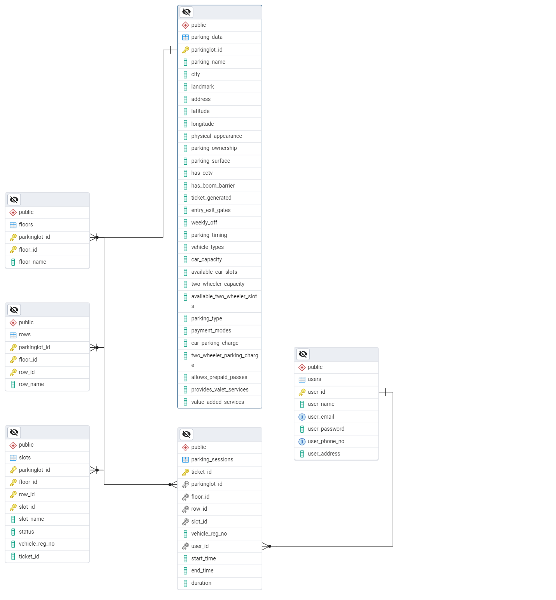

# Car_Parking_Database

## Description

This repository contains the PostgreSQL database schema and data for a parking management system. It includes:

* SQL dump (`parking_database_backup.sql`) with schema definitions and seed data.
* Entity-Relationship Diagram in Markdown (`parking_er_diagram.md`), Mermaid (`high_level_parking_er_diagram.mmd` and `low_level_parking_er_diagram.mmd`), and PNG (`ERD_parking_app.pgerd.png`) formats.

Use this database to manage parking lots, floors, rows, slots, users, and parking sessions.

---

## Table of Contents

1. [Installation](#installation)
2. [Database Setup](#database-setup)
3. [Entity-Relationship Diagram](#entity-relationship-diagram)
4. [High-Level Database Design](#high-level-database-design)
5. [Low-Level Database Design](#low-level-database-design)
6. [Table Schemas and Sample Data](#table-schemas-and-sample-data)

---

## Installation

1. Ensure you have PostgreSQL installed (version 12+).
2. Clone this repository:

   ```bash
   git clone <repository_url>
   cd <repository_folder>
   ```
3. Create a new database:

   ```bash
   psql -U postgres
   CREATE DATABASE parking_db;
   \q
   ```
4. Import the SQL dump:

   ```bash
   psql -U postgres -d parking_db -f parking_database_backup.sql
   ```

---

## Database Setup

1. Connect to the database:

   ```bash
   psql -U postgres -d parking_db
   ```
2. Verify tables have been created:

   ```sql
   \dt
   ```
3. Inspect seed data:

   ```sql
   SELECT * FROM parkinglots_details LIMIT 5;
   ```

---

## Entity-Relationship Diagram



Mermaid versions:

* High-level: `high_level_parking_er_diagram.mmd`
* Low-level: `low_level_parking_er_diagram.mmd`
* Markdown source: `parking_er_diagram.md`

---

## High-Level Database Design

At a glance, the database comprises six core tables:

* **parkinglots\_details**: Metadata for each parking lot.
* **floors**: Floors within each parking lot (1-to-many).
* **rows**: Rows of slots on each floor (1-to-many).
* **slots**: Individual parking slots (1-to-many).
* **users**: Registered system users.
* **parking\_sessions**: Records of parking sessions, linking users and slots.

Entities are normalized to reduce redundancy. Composite primary keys are used in `floors`, `rows`, and `slots` to uniquely identify nested resources.

---

## Low-Level Database Design

* **Primary Keys**:

  * `parkinglots_details.parkinglot_id`
  * Composite keys: `(parkinglot_id, floor_id)` in `floors`; `(parkinglot_id, floor_id, row_id)` in `rows`; `(parkinglot_id, floor_id, row_id, slot_id)` in `slots`.
  * `users.user_id`
  * `parking_sessions.ticket_id`

* **Foreign Keys**:

  * `floors.parkinglot_id` → `parkinglots_details.parkinglot_id`
  * `rows.(parkinglot_id, floor_id)` → `floors.(parkinglot_id, floor_id)`
  * `slots.(parkinglot_id, floor_id, row_id)` → `rows.(parkinglot_id, floor_id, row_id)`
  * `slots.ticket_id` → `parking_sessions.ticket_id`
  * `parking_sessions.(parkinglot_id, floor_id, row_id, slot_id)` → `slots` composite key
  * `parking_sessions.user_id` → `users.user_id`

* **Generated Columns**:

  * `parking_sessions.duration_hrs` calculates the hours between `end_time` and `start_time`, rounded to one decimal place.

* **Constraints**:

  * `slots.status` check: only 0 (free) or 1 (occupied).
  * `slots` occupancy rule: if `status = 1`, then `vehicle_reg_no` and `ticket_id` must be non-NULL; if `status = 0`, both must be NULL.

---

## Table Schemas and Sample Data

### `parkinglots_details`

| Column                         | Type    | Constraints  | Description                      |
| ------------------------------ | ------- | ------------ | -------------------------------- |
| parkinglot\_id                 | integer | PK, NOT NULL | Unique parking lot identifier    |
| parking\_name                  | text    |              | Name of the parking lot          |
| city                           | text    |              | City location                    |
| landmark                       | text    |              | Nearby landmark                  |
| address                        | text    |              | Full address                     |
| latitude, longitude            | numeric |              | Geographic coordinates           |
| physical\_appearance           | text    |              | Description of lot appearance    |
| parking\_ownership, surface    | text    |              | Ownership and surface type       |
| has\_cctv, has\_boom\_barrier  | text    |              | Security features                |
| ticket\_generated              | text    |              | Ticketing mechanism              |
| entry\_exit\_gates             | text    |              | Gate details                     |
| weekly\_off                    | text    |              | Weekly closure day               |
| parking\_timing                | text    |              | Operating hours                  |
| vehicle\_types                 | text    |              | Allowed vehicle categories       |
| car\_capacity                  | integer |              | Total car slots                  |
| available\_car\_slots          | integer |              | Currently free car slots         |
| two\_wheeler\_capacity         | integer |              | Total two-wheeler slots          |
| available\_two\_wheeler\_slots | integer |              | Currently free two-wheeler slots |
| parking\_type                  | text    |              | Open/covered                     |
| payment\_modes                 | text    |              | Supported payment methods        |
| car\_parking\_charge           | text    |              | Rate for cars                    |
| two\_wheeler\_parking\_charge  | text    |              | Rate for two-wheelers            |
| allows\_prepaid\_passes        | text    |              | Prepaid pass availability        |
| provides\_valet\_services      | text    |              | Valet service option             |
| value\_added\_services         | text    |              | Other services                   |

#### Sample Data

| parkinglot\_id | parking\_name                  | city      | car\_capacity | available\_car\_slots | two\_wheeler\_capacity | available\_two\_wheeler\_slots |
| -------------- | ------------------------------ | --------- | ------------- | --------------------- | ---------------------- | ------------------------------ |
| 2              | Azadpur - Commercial Complex   | New Delhi | 200           | 150                   | 100                    | 80                             |
| 3              | ISBT Kashmere Gate - Bus Stand | New Delhi | 300           | 200                   | 150                    | 120                            |

---

### `floors`

| Column         | Type    | Constraints        | Description                      |
| -------------- | ------- | ------------------ | -------------------------------- |
| parkinglot\_id | integer | PK (composite), FK | References `parkinglots_details` |
| floor\_id      | integer | PK (composite)     | Floor identifier per lot         |
| floor\_name    | varchar | NOT NULL           | Descriptive floor name           |

#### Sample Data

| parkinglot\_id | floor\_id | floor\_name |
| -------------- | --------- | ----------- |
| 1              | 1         | 1st floor   |
| 1              | 2         | 2nd floor   |

---

### `rows`

| Column         | Type    | Constraints        | Description              |
| -------------- | ------- | ------------------ | ------------------------ |
| parkinglot\_id | integer | PK (composite), FK | References `floors`      |
| floor\_id      | integer | PK (composite), FK | References `floors`      |
| row\_id        | integer | PK (composite)     | Row identifier per floor |
| row\_name      | varchar | NOT NULL           | Descriptive row name     |

#### Sample Data

| parkinglot\_id | floor\_id | row\_id | row\_name |
| -------------- | --------- | ------- | --------- |
| 1              | 1         | 1       | A row     |
| 1              | 1         | 2       | B row     |

---

### `slots`

| Column           | Type    | Constraints        | Description                            |
| ---------------- | ------- | ------------------ | -------------------------------------- |
| parkinglot\_id   | integer | PK (composite), FK | References `rows`                      |
| floor\_id        | integer | PK (composite), FK | References `rows`                      |
| row\_id          | integer | PK (composite), FK | References `rows`                      |
| slot\_id         | integer | PK (composite)     | Slot identifier per row                |
| slot\_name       | varchar | NOT NULL           | Descriptive slot code                  |
| status           | integer | DEFAULT 0          | 0=Free, 1=Occupied                     |
| vehicle\_reg\_no | varchar |                    | Registration number if occupied        |
| ticket\_id       | varchar | FK                 | Active session ticket ID (if occupied) |

#### Sample Data

| parkinglot\_id | floor\_id | row\_id | slot\_id | slot\_name | status | vehicle\_reg\_no | ticket\_id |
| -------------- | --------- | ------- | -------- | ---------- | ------ | ---------------- | ---------- |
| 1              | 1         | 1       | 1        | A1         | 0      | NULL             | NULL       |
| 1              | 1         | 1       | 2        | A2         | 0      | NULL             | NULL       |

---

### `users`

| Column          | Type    | Constraints      | Description            |
| --------------- | ------- | ---------------- | ---------------------- |
| user\_id        | integer | PK, AUTO-INCR    | Unique user identifier |
| user\_name      | varchar | NOT NULL         | Full name              |
| user\_email     | varchar | NOT NULL, UNIQUE | Email address          |
| user\_password  | varchar | NOT NULL         | Hashed password        |
| user\_phone\_no | varchar | NOT NULL         | Contact number         |
| user\_address   | text    |                  | Residential address    |

#### Sample Data

| user\_id | user\_name   | user\_email                                                 | user\_phone\_no | user\_address                  |
| -------- | ------------ | ----------------------------------------------------------- | --------------- | ------------------------------ |
| 1        | Alice Sharma | [alice.sharma@example.com](mailto:alice.sharma@example.com) | 9876543210      | 123 MG Road, Delhi             |
| 2        | Bob Gupta    | [bob.gupta@example.org](mailto:bob.gupta@example.org)       | 9123456789      | Flat 5B, Indira Nagar, Lucknow |

---

### `parking_sessions`

| Column           | Type      | Constraints | Description                                        |
| ---------------- | --------- | ----------- | -------------------------------------------------- |
| ticket\_id       | varchar   | PK          | Unique session ticket identifier                   |
| parkinglot\_id   | integer   | FK          | References `parkinglots_details`                   |
| floor\_id        | integer   | FK          | References `floors`                                |
| row\_id          | integer   | FK          | References `rows`                                  |
| slot\_id         | integer   | FK          | References `slots`                                 |
| vehicle\_reg\_no | varchar   | NOT NULL    | Vehicle registration number                        |
| user\_id         | integer   | FK          | References `users`                                 |
| start\_time      | timestamp |             | Session start timestamp                            |
| end\_time        | timestamp |             | Session end timestamp (NULL if ongoing)            |
| duration\_hrs    | numeric   | GENERATED   | Computed duration in hours, rounded to one decimal |

#### Sample Data

| ticket\_id | parkinglot\_id | floor\_id | row\_id | slot\_id | vehicle\_reg\_no | user\_id | start\_time         | end\_time           | duration\_hrs |
| ---------- | -------------- | --------- | ------- | -------- | ---------------- | -------- | ------------------- | ------------------- | ------------- |
| TICKET001  | 1              | 1         | 1       | 3        | DL4CAF5030       | 1        | 2025-05-01 08:00:00 | 2025-05-01 10:30:00 | 2.5           |
| TICKET002  | 1              | 2         | 1       | 1        | MH12AB1234       | 2        | 2025-05-02 09:15:00 | NULL                | NULL          |

---

## Additional Notes

* You can modify or extend the schema by editing `parking_database_backup.sql`.
* For updating diagrams, regenerate Mermaid files and export new PNGs.
* To reset data, drop and recreate the database using the SQL dump.
